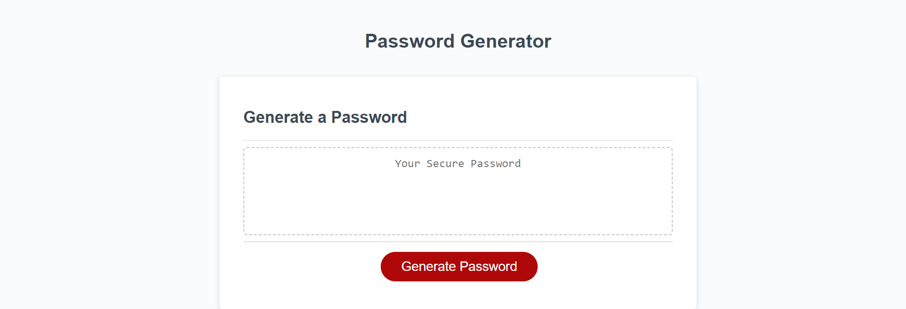

# Password-Generator

This project was created to help me learn javascript and it's many functions. It is meant to provide a unique and hard to crack password so that your data is better protected. I learned how functions in javascript work and how to output a randomly generated string from those functions. 

# Installation 

N/A

# Usage

This project is to be used to generate unique passwords to protect your online data.

# Image of the live website

# Links

[My Github](https://github.com/cfinn7789/Password-Generator)
[The website](https://cfinn7789.github.io/Password-Generator/)

